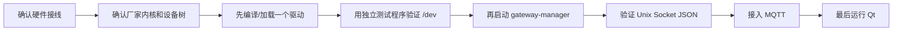

# 智能网关学习流程图

## 总体数据流

```mermaid
flowchart TD
    A[正点原子 I.MX6U ALPHA V2.2] --> B[设备树 DTS/DTB]
    B --> C[Linux I2C/Platform 总线]
    C --> D1[DS18B20 1-Wire 驱动]
    C --> D2[SHT30 I2C 驱动]
    C --> D3[GPIO 按键/LED 驱动]
    D1 --> E[/dev/ds18b20 原始温度]
    D2 --> F[/dev/sht30 原始温湿度]
    D3 --> G[/dev/gpio-event 按键事件/LED ioctl]
    E --> H[gateway-manager C 后端]
    F --> H
    G --> H
    H --> I[浮点换算、阈值、状态管理]
    I --> J[Unix Socket JSON]
    J --> K[Qt 本地监控]
    I --> L[MQTT 发布/订阅]
    L --> M[云端平台]
    H --> N[UART 舵机控制]
```

## 推荐学习顺序



## 每一层负责什么

| 层次 | 学习重点 | 输出 |
|---|---|---|
| 设备树 | 总线、地址、GPIO、pinctrl | 硬件描述 |
| 内核驱动 | probe/remove、I2C、字符设备、中断、并发 | `/dev` 接口 |
| 用户态 C | read、ioctl、线程、浮点换算、JSON | 网关业务状态 |
| MQTT 模块 | 配置解析、连接、发布、订阅、重连 | 云端数据 |
| Qt | Unix Socket、JSON、信号槽、界面 | 本地监控 |
| 测试 | 正常、断开、错误、重启恢复 | 验收记录 |

## 实际操作顺序

1. 先用厂家 BSP 启动开发板，确认 `uname -a`、网络和 I2C 总线。
2. 只启用一个已确认的设备树节点，先验证驱动能否进入 `probe()`。
3. 运行 `app/tests` 下对应测试程序，确认 `/dev` 读写正确。
4. 再启动 `gateway-manager`，检查 `/tmp/smart-gateway.sock` 的 JSON。
5. 填写 `configs/mqtt.conf`，验证 MQTT 发布和云端命令。
6. 最后启动 Qt，观察界面数据和 LED 控制。

任何一步失败，都先停在这一层排查，不要同时修改设备树、驱动、后端和 Qt。
